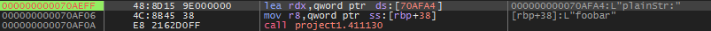
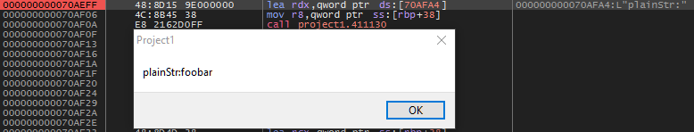

# XorUtil
Utilitaire d'obfuscation de code.


## Utilisation

### Exemple Delphi

Une fois le tableau et le code de la routine géneré, copiez la constante ainsi que la routine dans votre unité de code.

```Pascal
interface

const
  XoredStr: Array[0..5] of byte=($3C, $35, $35, $38, $3B, $28); // string: foobar
  
function UnXor: String;
```

```Pascal
implementation

function UnXor: String;
var
  I: Integer;
  aString: String;
begin
  For I := 0 to 5   do
    aString := aString + chr(xoredStr[I] xor $5A);
  Result := aString;
end;

```

Exemple d'appel depuis un bouton :

```Pascal
procedure TForm1.Button1Click(Sender: TObject);
var
  plainStr: String;
begin
  try
    plainStr := UnXor;
    ShowMessage(plainStr);
  finally
    plainStr := '';
  end;
end;
```

### Screenshot desassembleur

- Exécution, point d’arrêt sur ShowMessage()


- Après exécution


- La recherche de chaînes de caractères dans le desassembleur donnera 0 résultat.